# Updates on the causality measures of time series

\- Pablo

## Choice of GAM parameters for CCM

There are two main parameters that determine the fit:

- $n_{splines}$ : the number of splines used to fit the data, which should not be higher than the number of datapoints (overfitting)
- $\lambda$: the penalty for overfitting, a higher $\lambda$ leads to smoother curves and a low $\lambda$ gives us curves with sharp turns that are more likely to go near each datapoint.

The *grid search* algorithm from pyGAM looks for a fit that captures the general trend of the curve without overfitting. We compare this to a fit of 140 splines (same as the number of datapoints) with $\lambda = 0.01$, that goes near every point. We refer to each as

- grid
- fit_140_0.01

The following plots show both fits on the species Pinus and Betula.

### grid

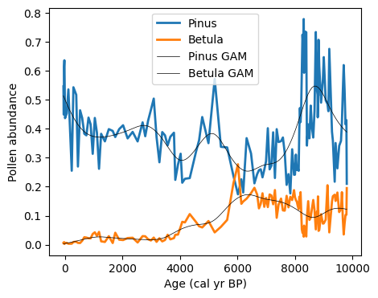

### fit_140_0.01

The results suggest that the grid configuration erases a large part of the information from the time series, making it impossible to determine any causal relationship with the CCM method. More specifically, it almost always returns a very high $\rho$. Here are the histograms of the results obtained for every pair of species using each fit.

### grid fit

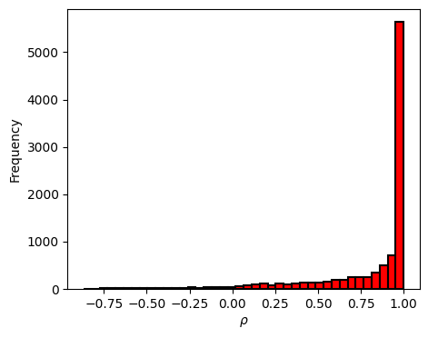

### fit_140_0.01

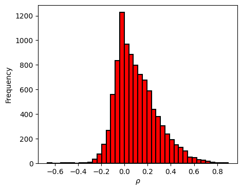

Looking at any pair of time series that return $\rho \approx 1$, like Gentiana and Osmunda, we can understand why these values are so high.

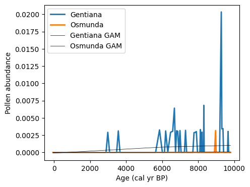

The following plot shows the state space reconstruction for both variables in 2D

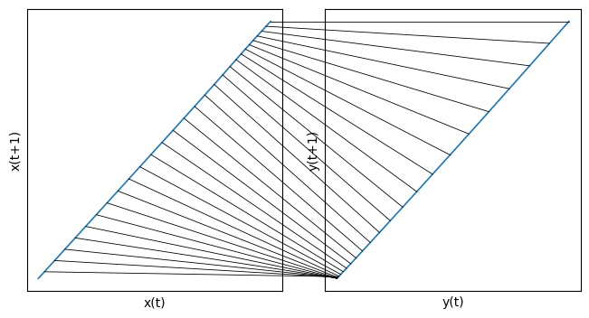

In CCM, the nearest neighbors from (x(t),x(t-1)) in the shadow manifold Mx are then used to estimate y(t), meaning y(t) left a signature on Mx and thus y causes x in some way. Here, the nearest neighbors from (x(t), x(t-1)) are the points closest to it in time, and the same holds in My, meaning the prediction is always correct even if there is no causality. For CCM to work as intended, the closest neighbors should not be the points adjacent in time, and a very smooth function with very few datapoints will not work for our case.

The same pair using the fit_140_0.01 curves returns a $\rho$ of 0.0016 as opposed to 0.99998, with the following state space reconstruction.

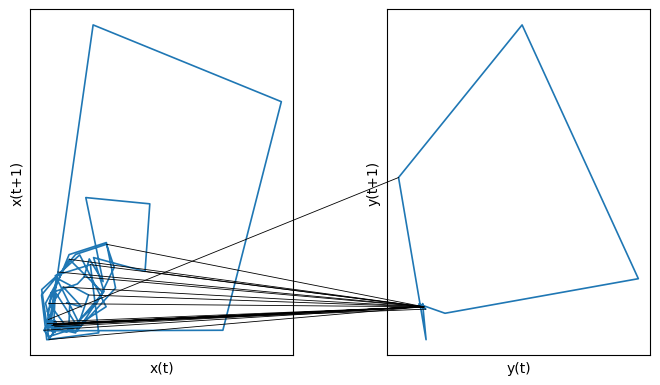

From now on, only the fit_140_0.01 approximaton will be used (not definitive)

## Analysis of CCM and Transfer Entropy in different dynamical systems

### Bidirectional two-species model

We use a set of equations that can lead to chaotic behavior in the system:

$$
\begin{align}
x_{t+1} &= x_t \bigl( 3.8 - 3.8 x_t - 0.1 y_t \bigr) + \epsilon_x(t)\,, \\
%
y_{t+1} &= y_t \bigl( 3.5 - 3.5 y_t - \gamma_{xy}\  x_t \bigr) + \epsilon_y(t)\,,
\end{align}
$$

Where $\epsilon_x(t)$ and $\epsilon_y(t)$ are independent Gaussian processes with variance $\sigma_x^2$ and $\sigma_y^2$. Here, variable $x$ slightly causes $y$ and the opposite depends on the variable $\gamma_{xy}$, which we intend to detect. These equations, in the absence of noise, lead to deterministic chaotic behavior. The time series is shown in the following plot.

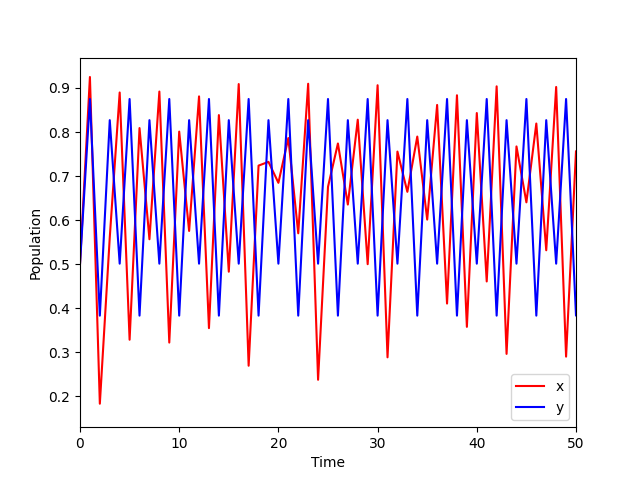

To analyze the capabilities of CCM, we test it against different values of the correlation $\gamma_xy$ and external random gaussian noise $\epsilon_x(t)$ and $\epsilon_y(t)$ (with variances $\sigma_x^2$ = $\sigma_y^2$ = 0 at first) for both variables.

#### CCM (1000 points)

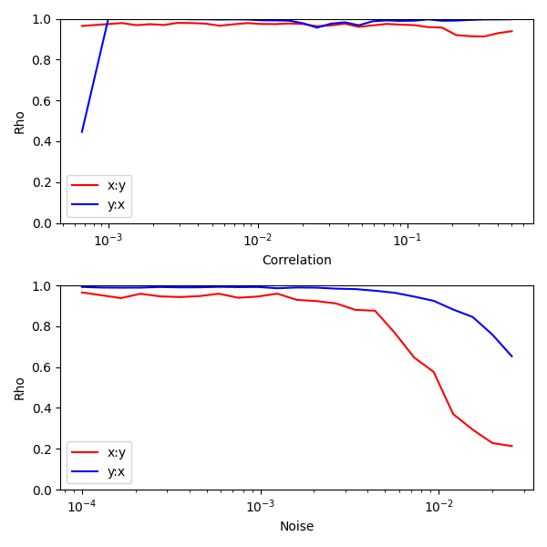

As the plots show, CCM is great at detecting causality in a deterministic system, but is very sensitive to external noise. These results suggest that the presence of noise prevents the correct reconstruction of the attractor, even when there is a lot of data (arround 1000 points). This may make CCM difficult to apply to real ecological systems where there are countless external variables.

In contrast to CCM, transfer entropy is based on information theory, and thus is supposed to deal with probability and noise. Let's see how it fares in the same conditions.

#### TE (1000 points)

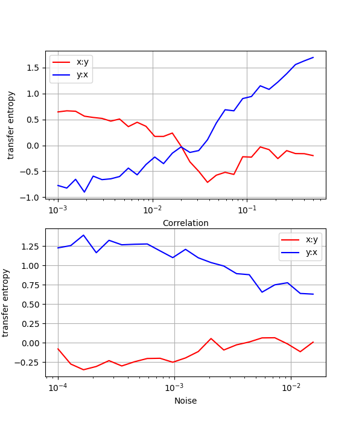

Transfer entropy appears to be significantly less sensitive, as it requires a strong correlation to detect the flow of information. It also seems to respond better to the random noise, although these equations only allow a variance of $\sigma_x^2 = \sigma_y^2 \sim 0.015$ before causing the variables to diverge with time. Let's try another set of equations.

### Coupled autoregressive model (CAM)

Similar to the previous system, the dynamics are driven by the following:

$$
\begin{align}
x_{t+1} &= 0.5x(t) + 0.2y(t) + \epsilon_x(t) \,, \\
%
y_{t+1} &= Cx(t) + 0.7y(t) + \epsilon_y(t) \,.
\end{align}
$$

Where $\epsilon_x(t)$ and $\epsilon_y(t)$ are also independent Gaussian processes, and C is the coupling strength from $x$ to $y$. Here we can see what the dynamics look like:

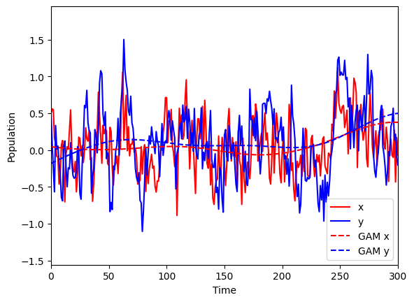

There are a few key differences between the dynamics of these equations and the ones before. The behavior is not chaotic in absence of noise, in fact the variables decrease exponentially to zero in that case. Additionally, the variables walk through a wider range of values and in smaller steps, as they reinforce each other and allow themselves to get far away from the equilibrium at zero (in contrast with the two-species model where they quickly oscillated). The results are as follows.

#### CCM (1000 points)

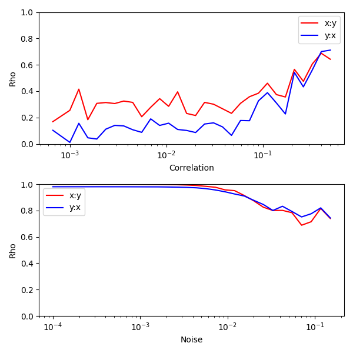

In the first panel, the noise amplitude is set to $\sigma_x^2 = \sigma_y^2 = 0.3$ (some noise is necessary for the dynamics to be sustained), and in the second panel the correlation $C = 0.5$.

It is common for CCM to return false positives, but performs well with the correlation on the first panel. On the second one, it gives us very high values in cases where the noise is not high enough and the values of $x$ and $y$ fall to zero.

#### TE (1000 points)

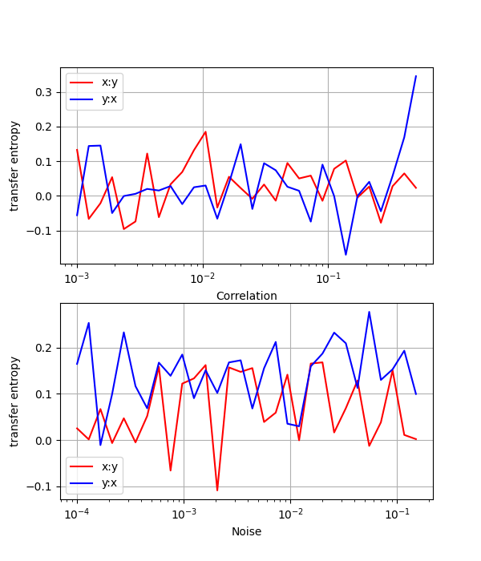
Just as with the CCM, the noise in the first panel is set to $\sigma_x^2 = \sigma_y^2 = 0.3$ and the correlation in the second panel to $C = 0.5$.

The transfer entropy stays very low even for larger values of the correlation. It is possible that, in these time series, the change in a variable provides more information than the variable itself when it comes to predicting the next value, but detrending (with GAM) does not seem to bring better results.

#### TE (detrended, 1000 points)

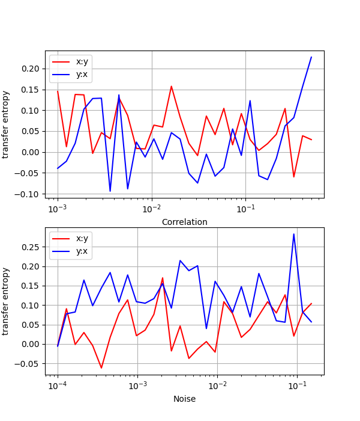

### Paramecium and Didinium (empirical predator-prey)

The next two time series come from the experiments performed in [[1]](#1) (data digitilized by [[2]](#2)), where they cultivated the two organisms with different concentrations of cerophyl $CC$ and measured their concentrations over time.

#### predator-prey (CC = 0.375)

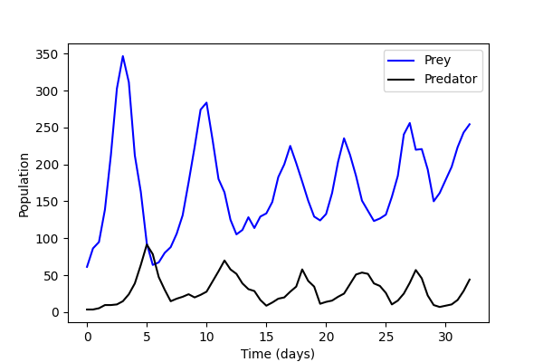

Results:

#### CCM

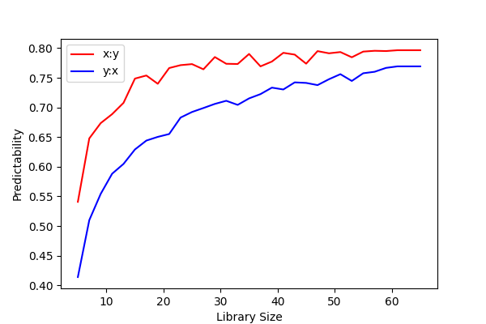
Where $x:y$ denotes the causality from predator to prey, and $y:x$ from prey to predator.

Transfer Entropy from predator to prey: 0.57

Transfer Entropy from prey to predator: -0.34

While the transfer entropy is not able to find causality from prey to predator, as it is less obvious than the other way around, CCM is.

#### predator-prey (CC = 0.5)

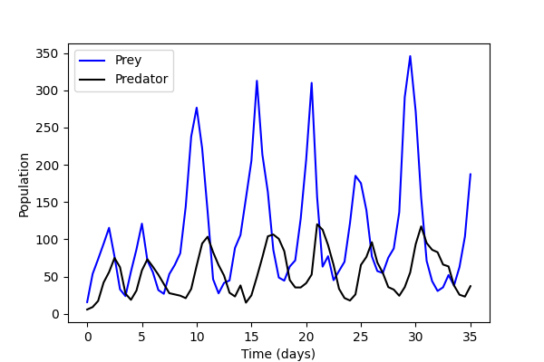

Results:

#### CCM

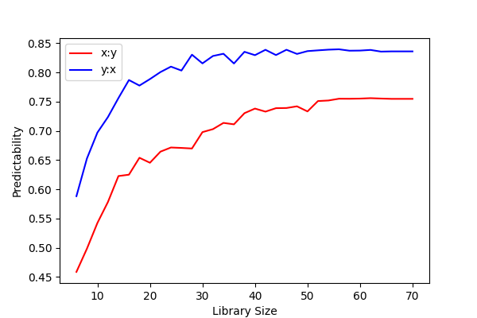
Where $x:y$ denotes the causality from predator to prey, and $y:x$ from prey to predator.

Transfer Entropy from x to y: 0.42

Transfer Entropy from y to x: 0.36

## Summary and p-values

| System (1000 points)                   | Method |    Direction    | (real) Correlation | Result | p-value (shuffle) |  p-value (swap) |
| :------------------------------------- | :----: | :--------------: | :---------------------: | :----: | ----------------: | --------------: |
| Bi-directional model                   |   TE   | $x\ \rarr \ y$ |      **0.4**      |  1.22  |     **0.0** |   **0.0** |
| Bi-directional model                   |   TE   | $y\ \rarr \ x$ |            0            | -0.45 |             0.235 |           0.305 |
| Bi-directional model                   |  CCM  | $x\ \rarr \ y$ |      **0.4**      |  0.97  |     **0.0** |   **0.0** |
| Bi-directional model                   |  CCM  | $y\ \rarr \ x$ |            0            | 0.134 |     **0.0** | **0.008** |
| Bi-directional model (no correlations) |   TE   | $x\ \rarr \ y$ |            0            | -0.191 |             0.271 |           0.262 |
| Bi-directional model (no correlations) |   TE   | $y\ \rarr \ x$ |            0            | -0.388 |             0.360 |           0.321 |
| Bi-directional model (no correlations) |  CCM  | $x\ \rarr \ y$ |            0            | -0.004 |             0.524 |           0.493 |
| Bi-directional model (no correlations) |  CCM  | $y\ \rarr \ x$ |            0            | 0.002 |             0.495 |           0.634 |
| CAM                                    |   TE   | $x\ \rarr \ y$ |      **0.4**      | 0.030 |             0.113 |           0.182 |
| CAM                                    |   TE   | $y\ \rarr \ x$ |      **0.2**      | 0.021 |             0.688 |           0.731 |
| CAM                                    |  CCM  | $x\ \rarr \ y$ |      **0.4**      |  0.90  |     **0.0** |   **0.0** |
| CAM                                    |  CCM  | $y\ \rarr \ x$ |      **0.2**      |  0.92  |     **0.0** | **0.002** |
| CAM (external common influence)        |   TE   | $x\ \rarr \ y$ |            0            | 0.397 |     **0.0** |           0.887 |
| CAM (external common influence)        |   TE   | $y\ \rarr \ x$ |            0            | 0.215 |     **0.0** |           0.882 |
| CAM (external common influence)        |  CCM  | $x\ \rarr \ y$ |            0            | 0.995 |     **0.0** | **0.001** |
| CAM (external common influence)        |  CCM  | $y\ \rarr \ x$ |            0            | 0.995 |     **0.0** | **0.003** |
| Paramecium_Didinium_0.375              |   TE   | $x\ \rarr \ y$ |     **True**     | -0.33 |             0.918 |            0.95 |
| Paramecium_Didinium_0.375              |   TE   | $y\ \rarr \ x$ |     **True**     |  0.57  |   **0.002** |   **0.0** |
| Paramecium_Didinium_0.375              |  CCM  | $x\ \rarr \ y$ |     **True**     |  0.50  |     **0.0** |           0.124 |
| Paramecium_Didinium_0.375              |  CCM  | $y\ \rarr \ x$ |     **True**     |  0.56  |     **0.0** |           0.081 |
| Paramecium_Didinium_0.5                |   TE   | $x\ \rarr \ y$ |     **True**     |  0.42  |   **0.001** | **0.032** |
| Paramecium_Didinium_0.5                |   TE   | $y\ \rarr \ x$ |     **True**     |  0.36  |   **0.007** |   **0.0** |
| Paramecium_Didinium_0.5                |  CCM  | $x\ \rarr \ y$ |     **True**     |  0.70  |     **0.0** | **0.034** |
| Paramecium_Didinium_0.5                |  CCM  | $y\ \rarr \ x$ |     **True**     |  0.73  |     **0.0** | **0.016** |

To summarize, Convergent Cross Mapping seems to return false positives, especially when there is some relationship between the variables (either on the opposite direction or with an external common influence). Transfer entropy however fails to find causality unless it's very strong.

Additionally, for only 40 points of data:

| System (40 points)      | Method |    Direction    | (real) Correlation | Result | p-value (shuffle) |  p-value (swap) |
| :------------------------ | :----: | :--------------: | :---------------------: | :----: | ----------------: | --------------: |
| Bi-directional model      |    TE    |    $x\ \rarr \ y$    |   **0.4**   |    0.367    |    **0.009**    |    0.056    |
| Bi-directional model      |    TE    |    $y\ \rarr \ x$    |         0   |    -0.804    |    0.243     |    0.193    |
| Bi-directional model      |    CCM    |    $x\ \rarr \ y$   | **0.4**     |    0.054    |    0.346     |    0.395    |
| Bi-directional model      |    CCM    |    $y\ \rarr \ x$   |       0     |    0.159    |    0.183     |    0.290    |
| Bi-directional model (no correlations)|  TE |$x\ \rarr \ y$ |   0         |    -0.524    |    0.050    |    0.083    |
| Bi-directional model (no correlations)|  TE |$y\ \rarr \ x$ |   0         |    -0.713    |    0.221    |    0.454    |
| Bi-directional model (no correlations)| CCM |$x\ \rarr \ y$ |   0         |    0.095    |    0.260    |    0.597    |
| Bi-directional model (no correlations)| CCM |$y\ \rarr \ x$ |   0         |    0.192    |    0.162    |    0.359    |
| CAM                       |    TE    |    $x\ \rarr \ y$    |   **0.4**   |    0.090    |    0.154     |    0.765    |
| CAM                       |    TE    |    $y\ \rarr \ x$    |   **0.2**   |    -0.205    |    0.187    |    0.772    |
| CAM                       |    CCM    |    $x\ \rarr \ y$   |  **0.4**    |    0.866    |    **0.000**    |    0.112    |
| CAM                       |    CCM    |    $y\ \rarr \ x$   |  **0.2**    |    0.990    |    **0.000**    |    **0.039**    |
| CAM (external common influence) |  TE  |   $x\ \rarr \ y$   |   0         |    0.049    |    0.999    |    0.975    |
| CAM (external common influence) |  TE  |   $y\ \rarr \ x$   |   0         |    -0.176    |    0.531    |    0.927    |
| CAM (external common influence) |  CCM |   $x\ \rarr \ y$   |   0         |    0.589    |    **0.000**    |    0.219    |
| CAM (external common influence) |  CCM |   $y\ \rarr \ x$   |   0         |    0.772    |    **0.000**    |    0.230    |
|  Paramecium_Didinium_0.375  |    TE    |    $x\ \rarr \ y$  |   **True**   |    -0.244    |    0.621    |    0.865    |
|  Paramecium_Didinium_0.375  |    TE    |    $y\ \rarr \ x$  |   **True**   |    0.392    |    **0.004**    |    **0.000**    |
|  Paramecium_Didinium_0.375  |    CCM    |    $x\ \rarr \ y$ |   **True**   |    0.480    |    **0.005**    |    0.761    |
|  Paramecium_Didinium_0.375  |    CCM    |    $y\ \rarr \ x$ |   **True**   |    0.602    |    **0.000**    |    0.506    |
|  Paramecium_Didinium_0.5  |    TE    |    $x\ \rarr \ y$    |   **True**   |    0.251    |    **0.031**    |    0.068    |
|  Paramecium_Didinium_0.5  |    TE    |    $y\ \rarr \ x$    |   **True**   |    0.349    |    **0.010**    |    **0.021**    |
|  Paramecium_Didinium_0.5  |    CCM    |    $x\ \rarr \ y$   |   **True**   |    0.857    |    **0.000**    |    **0.000**    |
|  Paramecium_Didinium_0.5  |    CCM    |    $y\ \rarr \ x$   |   **True**   |    0.723    |    **0.000**    |    **0.048**    |

For the surrogate series p-value calculation and the different transfer entropy algorithm from the package pyspi:

| System (200 points) |  Direction| (real) Correlation | TE | TE kraskov k1 | TE kraskov DCE | TE kraskov |
| :------------------------ | :----: | :--------------: | :---------------------: | :----: | ----------------: | :--------------: |
|   Bi-directional model   |   $x\ \rarr \ y$   |   **0.4**   |   **0.000**   |   **0.000**   |   **0.000**   |   **0.000**   |   
|   Bi-directional model   |   $y\ \rarr \ x$   |   0   |   0.182   |   0.572   |   0.573   |   0.185   |   
|   Bi-directional model (no correlations)   |   $x\ \rarr \ y$   |   0   |   0.380   |   0.595   |   0.819   |   0.999   |   
|   Bi-directional model (no correlations)   |   $y\ \rarr \ x$   |   0   |   0.632   |   0.615   |   0.611   |   0.779   |   
|   CAM   |   $x\ \rarr \ y$   |   **0.4**   |   0.389   |   **0.006**   |   **0.035**   |   **0.023**   |   
|   CAM   |   $y\ \rarr \ x$   |   **0.2**   |   0.137   |   **0.019**   |   **0.000**   |   0.119   |   
|   CAM (external common influence)   |   $x\ \rarr \ y$   |   0   |   **0.004**   |   1.000   |   0.671   |   1.000   |   
|   CAM (external common influence)   |   $y\ \rarr \ x$   |   0   |   **0.000**   |   **0.000**   |   **0.000**   |   0.993   |   
|   Paramecium_Didinium_0.375   |   $x\ \rarr \ y$   |   **True**   |   0.946   |   **0.006**   |   **0.001**   |   **0.041**   |   
|   Paramecium_Didinium_0.375   |   $y\ \rarr \ x$   |   **True**   |   **0.001**   |   **0.000**   |   **0.017**   |   0.445   |   
|   Paramecium_Didinium_0.5   |   $x\ \rarr \ y$   |   **True**   |   **0.003**   |   **0.000**   |   **0.001**   |   **0.024**   |   
|   Paramecium_Didinium_0.5   |   $y\ \rarr \ x$   |   **True**   |   **0.016**   |   **0.000**   |   **0.002**   |   **0.001**   |   

We settle for the Kraskov method with 4 nearest neighbours, dimension 1 for both source and destination series and time lag equal to 1 (above as TE kraskov k1), which has only returned one false positive, and is 

For the calculation of the p-value, we have used surrogate series constructed from the fourier decomposition of the original, and adding a phase (package pyunicorn -> timeseries.Surrogates.correlated_noise_surrogates() ). This breaks the time dependency but preserves the autocorrelation of the series.

A different method for obtaining the p-values that we examine is the **stationary bootstrap**. We assess whether in our case it is equivalent to bootstrap the source series exclusively versus both series. The opposite is suggested in [[3](#3),[4](#4)].

| System (200 points) |  Direction| (real) Correlation | Bootstrap source | Bootstrap both |
| :------------------------ | :----: | :--------------: | :---------------------: | :----: | 
|   Bi-directional model   |   $x\ \rarr \ y$   |   **0.4**   |   **0.0000**   |   **0.0000**   |
|   Bi-directional model   |   $y\ \rarr \ x$   |   0   |   0.5347   |   0.0709   |
|   CAM   |   $x\ \rarr \ y$   |   **0.4**   |   **0.0029**   |   **0.0022**   |  
|   CAM   |   $y\ \rarr \ x$   |   **0.2**   |   0.0503   |   0.0848   |   
|   CAM (external common influence)   |   $x\ \rarr \ y$   |   0   |   0.9997   |   0.9999   |
|   CAM (external common influence)   |   $y\ \rarr \ x$   |   0   |   **0.0035**   |   **0.0011**   |
|   Paramecium_Didinium_0.375   |   $x\ \rarr \ y$   |   **True**   |   **0.0291**   |   **0.0156**   |
|   Paramecium_Didinium_0.375   |   $y\ \rarr \ x$   |   **True**   |   **0.0071**   |   **0.0015**   |
|   Paramecium_Didinium_0.5   |   $x\ \rarr \ y$   |   **True**   |   **0.0007**   |   **0.0001**   |
|   Paramecium_Didinium_0.5   |   $y\ \rarr \ x$   |   **True**   |   **0.0010**   |   **0.0000**   | 

# Data points and time intervals

Back to the data from la Mora, the distribution of data points over time is the same for every species, but not equidistant. The next figure shows the number of datapoints inside each interval. Given 140 data points, and assuming them to be equidistant, we can divide the timeline in 7 intervals of width 20. By overlapping them we get 6 intervals of width 40.

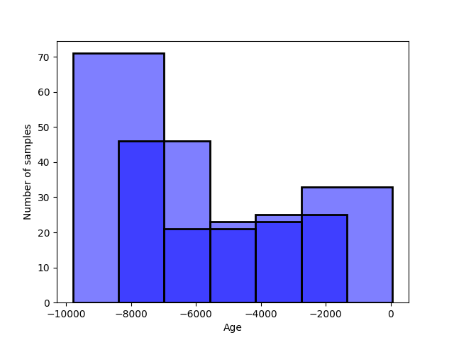

The average number of datapoints is by definition 40, but they range from 20 to 70.

<a id="1">[1]</a>
Veilleux, B. G. (1976). The analysis of a predatory interaction between Didinium and Paramecium.` `
DOI: https://doi.org/10.7939/r3-zvqq-gz50

<a id="2">[2]</a>
Jost, C., & Ellner, S. P. (2000). Testing for predator dependence in predator-prey dynamics: a non-parametric approach. Proceedings of the Royal Society of London. Series B: Biological Sciences, 267(1453), 1611-1620.` `
DOI: https://doi.org/10.1098/rspb.2000.1186

<a id="3">[3]</a>
Chávez, M., Martinerie, J., & Le Van Quyen, M. (2003). Statistical assessment of nonlinear causality: application to epileptic EEG signals. Journal of neuroscience methods, 124(2), 113-128.

<a id="4">[4]</a>
Chávez, M., Martinerie, J., & Le Van Quyen, M. (2003). Statistical assessment of nonlinear causality: application to epileptic EEG signals. Journal of neuroscience methods, 124(2), 113-128.
