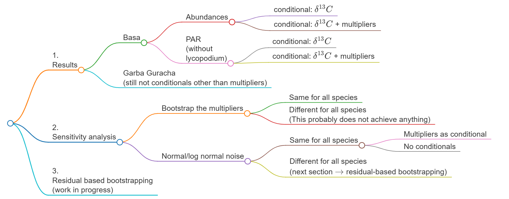
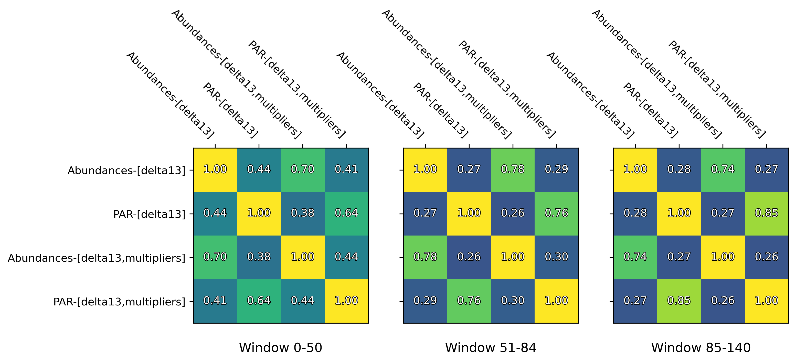
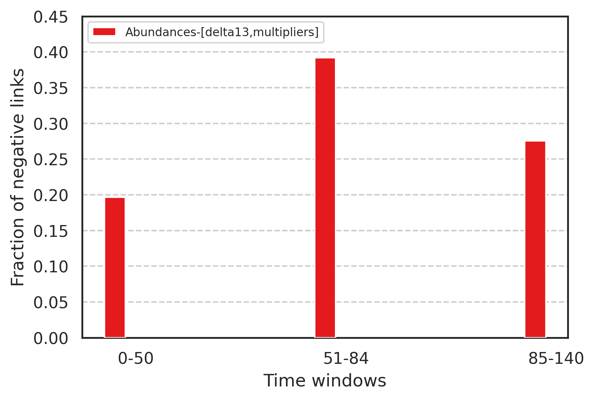
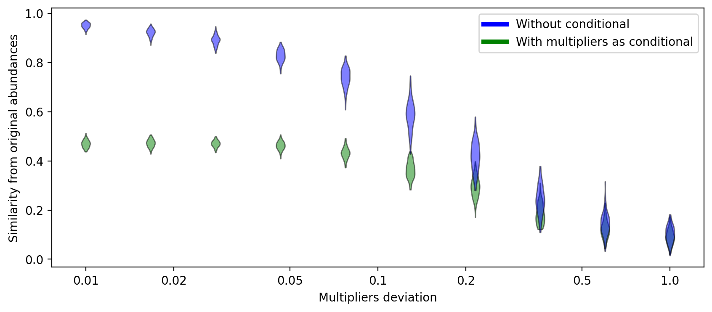

# August updates and to-do

\- Pablo

There are three main isues at the moment as laid out in the following graph.

## 1. Results

For Basa de la Mora there are 4 combinations of conditional variables to use, having two of them: the $\delta^{13}C$ and the *multipliers*, which are the accumulation rate divided by the volume at each timestep. When multiplying the abundances by these multipliers we would get the PAR (not really, because we are not using the lycopodium). However, these multipliers should serve as a proxy for the total amount of pollen deposited over time.

We have then 4 different networks to compare and choose from. (not plotted yet, however, the results with the abundances are very consistent and similar to the previous ones, meaning the addition of the conditional variables do not change the outcome much. The results using the PAR as variable are less consistent)

Here we show the similarities between the inferred networks based on the different combination of data and conditionals for each window.

As for the percentage of negative links given by any method, they are shown in the following graph.

The validity of this comparison is to be evaluated in section 3, as there is a possibility that the abundance of links (and in particular negative links) comes from the low amount of points in window 51-84 driving the p-values lower than they should be.
## 2. Sensitivity analysis

The most critical source of error comes from multipliers that operate on *EVERY* species at the same time (but different for each time step, of course). This is not ideal, but hopefully it is worse than any kind of error that would affect each species differently. We study the way these multipliers affect the results.

Firstly, we bootstrap the multipliers we already have from Basa de la Mora (meaning we take the abundances and multiply them by randomly sampled multipliers), and compare them to the original one. The resulting networks are on average 1% similar to the original, which implies a high sensitivity with respect to these multipliers.

Secondly, we analyze the sensitivity depending on the variation of the multipliers (sampled from a normal distribution of mean 1 and varying deviation.)

We compare the results when using the same multipliers as conditional, to see if the error is reduced.

Using the multiplier as conditional reduces the similarity to the original network by approximately 50% because the random noise can explain some links. However, it takes more error to drop, suggesting it is benefitial to include the original multipliers from Basa de la Mora in the model as conditional.

For comparison, the original multipliers used for the calculation of the PAR in Basa de la Mora have a standard deviation of 0.45 and the similarity between the abundances-PAR networks is 0.44 as shown in the matrix from the previous figure.

To-do: compare this to the effect of multipliers that affect each species *differently*.

## 3. Residual-based bootstrapping

To adress the concerns of the validity of the Granger test beyond its p-value, residual-based bootstrapping seems to provide more accurate results when it comes to short time series.

The way it works is as follows:

- We fit the VAR model to the real data
- Bootstrap the residuals with replacement synchronously across variables to preserve the cross-series correlation
- Simulate synthetic series using the estimated VAR and bootstrapped residuals
- Test the causality again and count the number of times each edge is significant

This is work-in-progress as well.