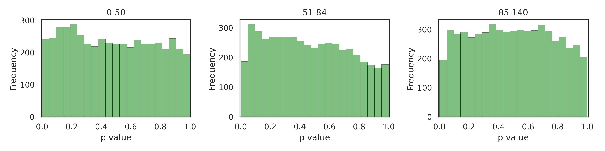
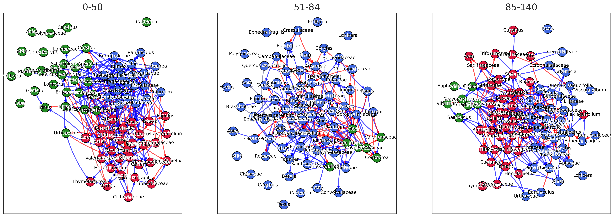
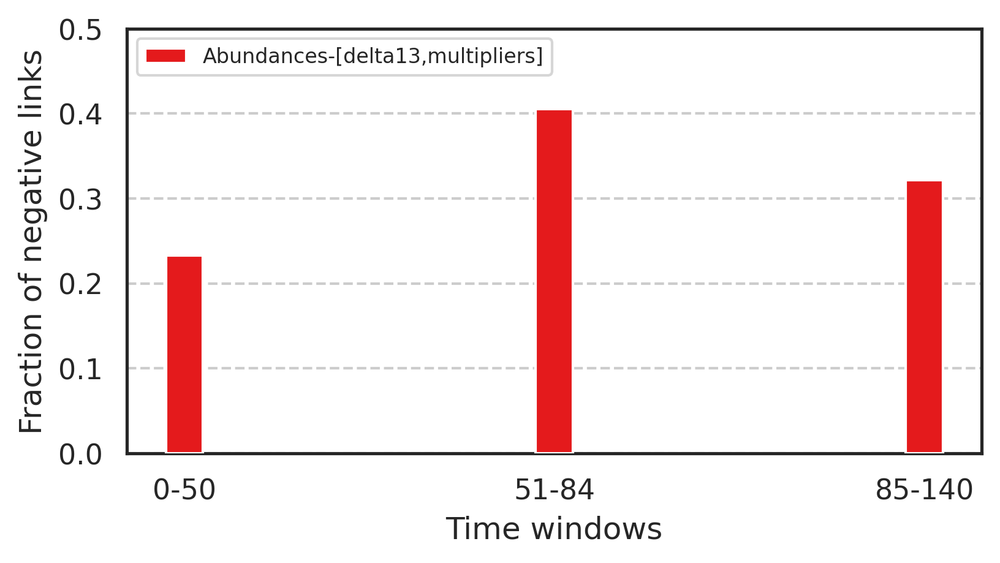
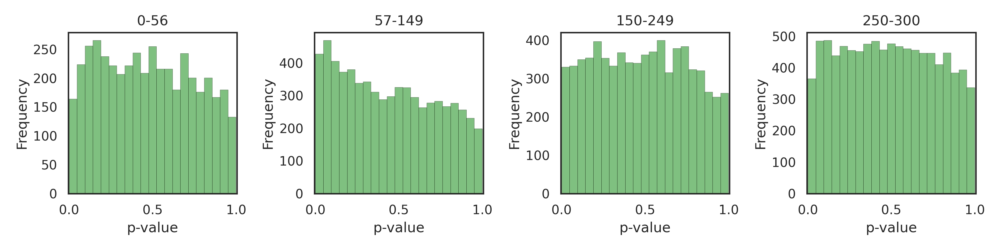
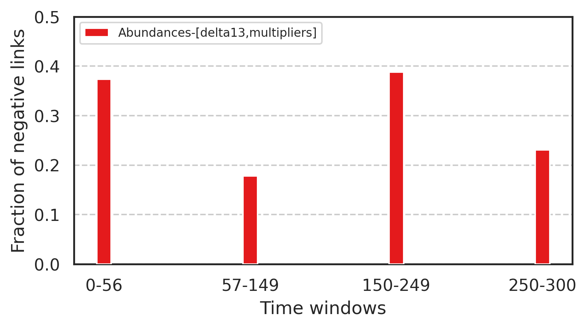

# August updates and to-do

\- Pablo

There are three main isues at the moment as laid out in the following graph.

## 1. Results

For Basa de la Mora there are 4 combinations of conditional variables to use, having two of them: the $ \delta^{13}C $ and the *multipliers*, which are the accumulation rate divided by the volume at each timestep. When multiplying the abundances by these multipliers we would get the PAR (not really, because we are not using the lycopodium). However, these multipliers should serve as a proxy for the total amount of pollen deposited over time.

We have then 4 different networks to compare and choose from. (not plotted yet, however, the results with the abundances are very consistent and similar to the previous ones, meaning the addition of the conditional variables do not change the outcome much. The results using the PAR as variable are less consistent)

Here we show the similarities between the inferred networks based on the different combination of data and conditionals for each window.

As for the percentage of negative links given by any method, they are shown in the following graph.

The validity of this comparison is to be evaluated in section 3, as there is a possibility that the abundance of links (and in particular negative links) comes from the low amount of points in window 51-84 driving the p-values lower than they should be.
## 2. Sensitivity analysis

The most critical source of error comes from multipliers that operate on *EVERY* species at the same time (but different for each time step, of course). This is not ideal, but hopefully it is worse than any kind of error that would affect each species differently. We study the way these multipliers affect the results.

Firstly, we bootstrap the multipliers we already have from Basa de la Mora (meaning we take the abundances and multiply them by randomly sampled multipliers), and compare them to the original one. The resulting networks are on average 1% similar to the original, which implies a high sensitivity with respect to these multipliers.

Secondly, we analyze the sensitivity depending on the variation of the multipliers (sampled from a normal distribution of mean 1 and varying deviation.)

We compare the results when using the same multipliers as conditional, to see if the error is reduced.

Using the multiplier as conditional reduces the similarity to the original network by approximately 50% because the random noise can explain some links. However, it takes more error to drop, suggesting it is benefitial to include the original multipliers from Basa de la Mora in the model as conditional.

For comparison, the original multipliers used for the calculation of the PAR in Basa de la Mora have a standard deviation of 0.45 and the similarity between the abundances-PAR networks is 0.44 as shown in the matrix from the previous figure.

To-do: compare this to the effect of multipliers that affect each species *differently*.

## 3. Stationary bootstrapping

To adress the concerns of the validity of the Granger test beyond its p-value, stationary bootstrapping seems to provide more accurate results when it comes to short time series or heteroscedasticity (especially for series that are formed by mostly null values and a few positives, which result in much lower p-values than expected.)

The causality coefficient of each pair of original time series is compared with 1000 bootstrapped series pairs, giving an estimate of how likely is it to obtain the same causality between random series of similar composition.

For Basa de la Mora, we use the abundance of the species and include the multiplicators and delta13C data as conditional variables.
For Garba Guracha, we also use the abundance and only the multiplicators as a conditional variable.

### Basa de la Mora results

As mentioned, the p-value distribution shifts to larger values after applying bootstrapping. The lack of links below the 0.01 threshold leads us to increase it to 0.05.

These are the corresponding networks obtained for Basa de la Mora.

The main result regarding the percentage of negative links is consistent with previous results as seen here.

Other additional metrics such as temporality or eigenvector centrality are similar to previous results and close to those of comparable random graphs.

### Garba Guracha

As with Basa de la Mora, the p-values are more uniform after using bootstrapping.

Next are represented the networks obtained for the respective windows of Garba Guracha. Keep in mind that the color of the nodes is assigned to the inferred communities obtained through stochastic block modeling, which assigns disconnected nodes to a random existing community.

Again, lower percentages of negative links correspond to windows with higher fire activity.

